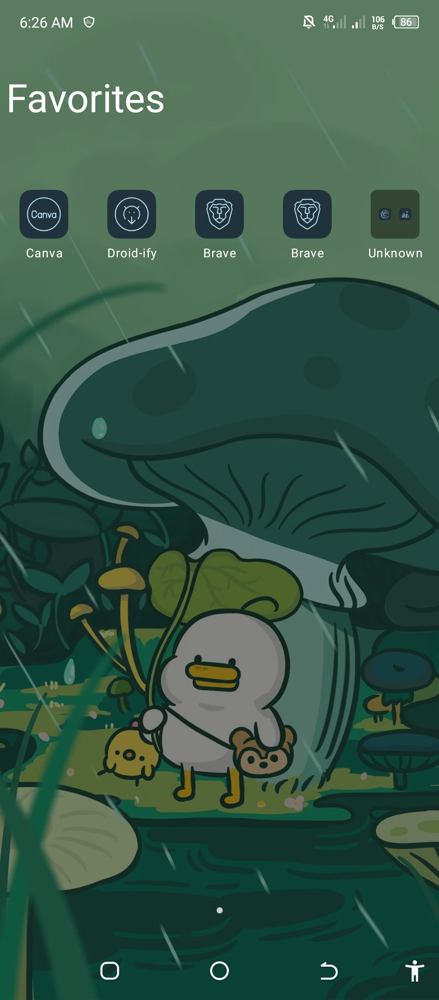

# Yagni Launcher

Only 2 MB Android Launcher, total control, zero bloat, zero tracking

> [!WARNING]
> This is an Alpha Stage Build. Expect bugs, instability, and incomplete features.

## About The Project

Most Android launchers are just AOSP Launcher3 forks. I wanted to build from scratch, make it easy for new developers to contribute, and follow solid coding practices to keep it sustainable. Open-source Launcher3 forks often get abandoned due to complexity, many still use Java and legacy APIs. Closed-source launchers are locking features behind paywalls and adding trackers. My goal is to offer powerful features with no compromises on privacy.

**YAGNI ("You Aren't Gonna Need It")** is a principle which arose from extreme programming (XP) that states a programmer should not add functionality until deemed necessary.

## Screenshots

## Links
- [Android Launchers Memory Usage In The Cached Processes](https://youtu.be/-0cEKr-H5FU?si=RhaWvdf5ElBFoHnJ)
- [Support Me On Ko-Fi](https://ko-fi.com/I3I01OJG21)

## License

**Yagni Launcher** is licensed under the GNU General Public License v3.0. See the [license](LICENSE)
for more
information.
