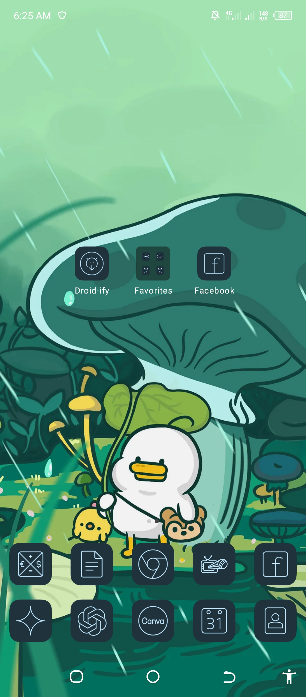
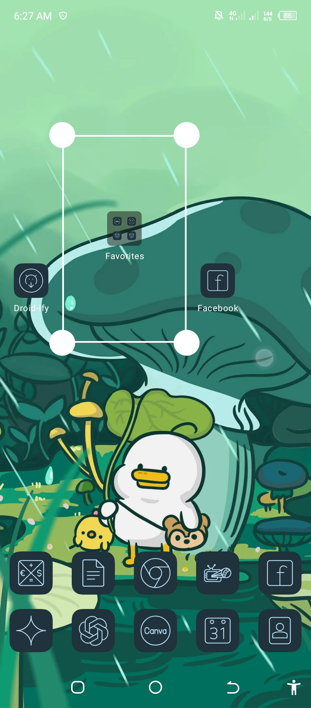
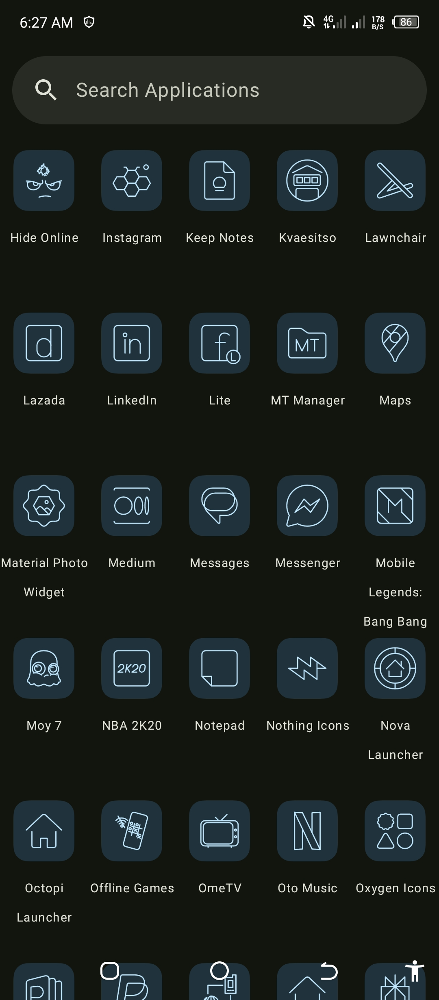
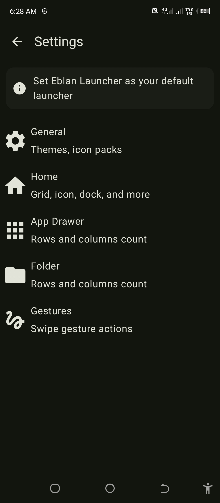

# Eblan Launcher

Android Launcher made from scratch using Kotlin, Coroutines and Jetpack Compose

About The Project
==================

Most Android launchers are just forks of AOSP’s Launcher3. I wanted to try something different—building from scratch while welcoming new developers and applying solid coding principles and best practices to keep the project alive for the long run. Open-source Launcher3 forks often end up abandoned because of their complexity, making it tough for newcomers to contribute. And, not gonna lie… a lot of them are still written in Java and rely on legacy APIs 🤣.

Meanwhile, many closed-source launchers are starting to get greedy—locking features behind paywalls and sneaking in trackers. My goal is to give everyone the joy of using powerful features without compromising privacy.

# Screenshots

# Architecture
Most of the code in this project is based on [Now In Android](https://github.com/android/nowinandroid), but it follows [Clean Architecture](https://blog.cleancoder.com/uncle-bob/2012/08/13/the-clean-architecture.html) instead.

# License
**Eblan Launcher** is licensed under the GNU General Public License v3.0. See the [license](LICENSE) for more
information.
